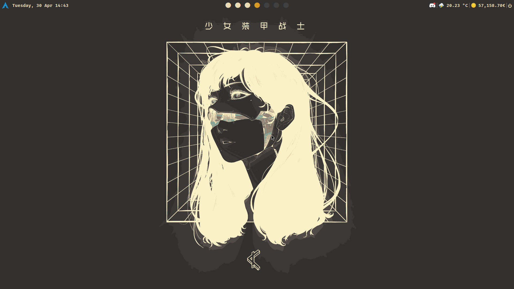

# dotfiles
Config files with lots of bugs, but it's starting to look like something. (although unoriginal)

Some more stuff I want to add that doesn't work out of the box even though I followed the docs:

- ALSAWidget 🔊
- WiFiIcon ᯤ
- Bluetooth ᛒ
- BatteryIcon 𓈆↯

